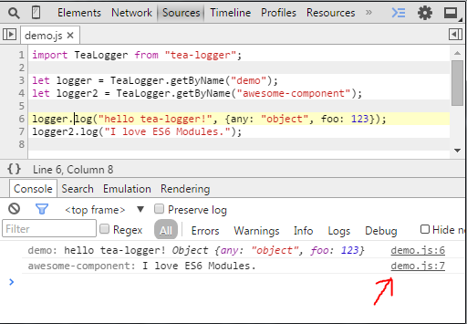
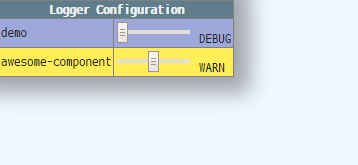

# tea-logger

The Logger Manager for frontend.

## Installation

```
$ npm install tea-logger --save
```

tea-logger has been designed on the assumption that uses together with [browserify](http://browserify.org/).

## Usage

### Basic

```js
import TeaLogger from "tea-logger";

let logger = TeaLogger.getByName("your-module-name");

logger.log("hello");
logger.info("hello");
logger.warn("hello");
logger.error("hello");
```

tea-logger has methods `log`, `info`, `warn`, and `error` as same as `console` object's.
Of course, debug tools show correct line and column.



Each logger instance has its logging level; `DEBUG`, `INFO`, `WARN`, `ERROR`, or `NONE`.
They'll write into console only if has lower level.
So you can concentrate into debugging for the current editting module.

| Level | `.log()` | `.info()` | `.warn()` | `.error()` |
|-------|----------|-----------|-----------|------------|
| DEBUG | write    | write     | write     | write      |
| INFO  | ignore   | write     | write     | write      |
| WARN  | ignore   | ignore    | write     | write      |
| ERROR | ignore   | ignore    | ignore    | write      |
| NONE  | ignore   | ignore    | ignore    | ignore     |

To set logging level:

```js
logger.level = TeaLogger.INFO; // or `= "info";`
```

### Configuration View

tea-logger has GUI to configure for logging level of loggers.

At first, please add `?debug` query string into your web page's URI.
Next, `click + T` (press `T` key with while down the mouse left button!).



Or from code:

```js
TeaLogger.showConfigurationView();
```

## Reference

```ts
declare module TeaLogger {
  // Constants for logging level.
  const DEBUG: TeaLoggerLevel;
  const INFO: TeaLoggerLevel;
  const WARN: TeaLoggerLevel;
  const ERROR: TeaLoggerLevel;
  const NONE: TeaLoggerLevel;

  // Getting instances.
  function getByName(name: string): TeaLogger;
  function getAll(): TeaLogger[];

  // Show/hide GUI.
  // When set `true` to `debugMode`, Then enable `click + T` gesture.
  // The default value of `debugMode` is `true` if URL has `?debug` query string, otherwise `false`.
  let debugMode: boolean
  function showConfigurationView(): void;
  function hideConfigurationView(): void;

  // Customizing writing logic.
  // The default value of `writer` is an instance that writes to `console`.
  let writer: Writer;


  interface TeaLoggerLevel {
    // nothing.
  }

  interface TeaLogger {
    name: string;
    level: TeaLoggerLevel;

    log(...args: any[]): void;
    info(...args: any[]): void;
    warn(...args: any[]): void;
    error(...args: any[]): void;
  }

  interface Writer {
    log(...args: any[]): void;
    info(...args: any[]): void;
    warn(...args: any[]): void;
    error(...args: any[]): void;
    coloredArgsForName(name: string): string[]
  }
}
```
